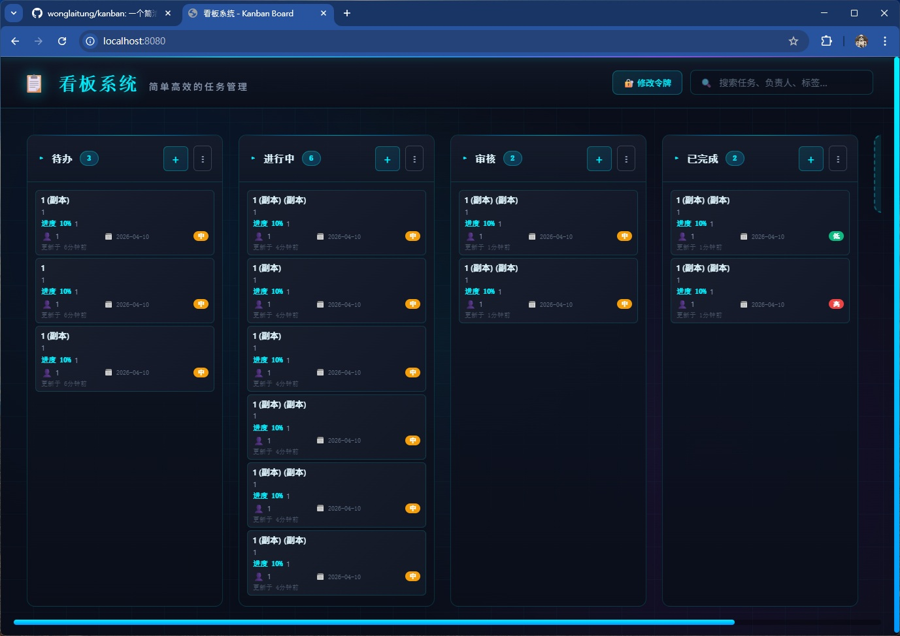

# 看板系统 (Kanban Board)

一个简洁实用的看板系统，用于小型团队（1-5人）管理组内任务。支持拖拽交互、任务详情管理和简单的令牌保护。

## 功能特性

- **拖拽式任务管理** - 流畅的拖拽体验，支持跨列移动和列内排序
- **多列状态流转** - 待办、进行中、审核、已完成
- **任务详情管理** - 标题、描述、负责人、优先级、截止日期、标签、进度
- **自定义列管理** - 添加、编辑、删除列
- **令牌保护** - 简单的访问控制，保护看板数据
- **实时更新时间** - 显示每个任务的最后更新时间
- **搜索功能** - 快速搜索任务、负责人、标签
- **响应式设计** - 适配不同屏幕尺寸
- **暗色主题** - 现代化的赛博朋克风格界面

## 技术栈

| 类别 | 技术选型 |
|------|---------|
| 前端框架 | React 18 + TypeScript |
| 构建工具 | Vite |
| 拖拽库 | @dnd-kit/core + @dnd-kit/sortable |
| HTTP客户端 | Axios |
| 后端服务 | Express + better-sqlite3 |
| 数据库 | SQLite |
| 容器化 | Docker |

## 界面展示

系统提供现代化的赛博朋克风格界面，支持拖拽交互、任务搜索和多列管理。



看板主界面展示所有任务列和任务卡片，支持拖拽任务在列之间移动，点击任务卡片可编辑详情。

## 快速开始

### 本地开发

1. **安装依赖**
   ```bash
   npm install
   cd server && npm install && cd ..
   ```

2. **启动开发服务器**
   
   终端1（前端）：
   ```bash
   npm run dev
   ```
   
   终端2（后端）：
   ```bash
   cd server && npm start
   ```

3. **访问应用**
   
   打开浏览器访问 `http://localhost:5173`

### Docker 部署

1. **构建镜像**
   ```bash
   docker build -t kanban-board .
   ```

2. **运行容器**
   ```bash
   # 基本运行（数据存储在容器内）
   docker run --name kanban -p 80:80 kanban-board

   # 数据持久化到宿主机（推荐）
   docker run --name kanban -p 80:80 \
     -v /path/to/kanban-data:/app/server/data \
     kanban-board
   ```

   参数说明：
   - `-p 80:80` - 端口映射，格式为 `宿主机端口:容器端口`
   - `-v /path/to/kanban-data:/app/server/data` - 数据卷挂载，将 SQLite 数据库存储到宿主机

3. **访问应用**

   打开浏览器访问 `http://localhost`

### 数据持久化

为了防止容器删除后数据丢失，建议将数据目录挂载到宿主机：

```bash
# 创建数据目录
mkdir -p ~/kanban-data

# 运行容器并挂载数据目录
docker run --name kanban -p 80:80 \
  -v ~/kanban-data:/app/server/data \
  kanban-board
```

数据备份：
```bash
# 备份数据库文件
cp ~/kanban-data/kanban.db ~/kanban-backup-$(date +%Y%m%d).db
```

数据恢复：
```bash
# 将备份文件复制到数据目录
cp ~/kanban-backup-20240101.db ~/kanban-data/kanban.db
```

## 项目结构

```
/data/kanban/
├── src/                    # 前端源码
│   ├── components/         # React 组件
│   │   ├── Board/         # 看板主容器
│   │   ├── Column/        # 列组件
│   │   ├── TaskCard/      # 任务卡片
│   │   ├── TaskModal/     # 任务编辑弹窗
│   │   ├── ColumnModal/   # 列编辑弹窗
│   │   ├── TokenModal/    # 令牌输入弹窗
│   │   └── ConfirmDialog/ # 确认对话框
│   ├── hooks/             # 自定义 Hooks
│   ├── services/          # API 服务
│   ├── types/             # TypeScript 类型定义
│   └── styles/            # 全局样式
├── server/                 # 后端源码
│   ├── server.js          # Express 服务器
│   └── db.js              # 数据库数据库初始化
├── docs/                   # 文档
├── Dockerfile              # Docker 配置
└── package.json            # 项目配置
```

## 数据模型

### Column (列)
```typescript
interface Column {
  id: string;
  title: string;
  order: number;
}
```

### Task (任务)
```typescript
interface Task {
  id: string;
  title: string;
  description: string;
  assignee: string;
  priority: 'high' | 'medium' | 'low';
  dueDate: string;
  tags: string[];
  columnId: string;
  order: number;
  progress: number;        // 0-100
  progressText: string;    // 进度描述文字
  createdAt: string;
  updatedAt: string;
}
```

### Settings (设置)
```typescript
interface Settings {
  token: string;  // 访问令牌
}
```

## API 端点

### 列管理
- `GET /api/columns` - 获取所有列
- `POST /api/columns` - 创建新列
- `PUT /api/columns/:id` - 更新列
- `DELETE /api/columns/:id` - 删除列

### 任务管理
- `GET /api/tasks` - 获取所有任务
- `GET /api/tasks/:id` - 获取单个任务
- `POST /api/tasks` - 创建任务
- `PUT /api/tasks/:id` - 更新任务
- `DELETE /api/tasks/:id` - 删除任务
- `POST /api/tasks/batch` - 批量更新任务（拖拽排序）

### 设置管理
- `GET /api/settings` - 获取设置
- `PUT /api/settings` - 更新设置

## 功能说明

### 令牌保护
- 首次访问时需要设置令牌
- 后续访问需输入令牌验证
- 可通过界面按钮修改令牌
- 令牌存储在服务器端 SQLite 数据库

### 任务优先级
- **高优先级** - 红色标识
- **中优先级** - 黄色标识
- **低优先级** - 绿色标识

### 拖拽功能
- 支持列内拖拽排序
- 支持跨列拖拽移动
- 实时保存位置信息

### 并发控制
- 使用乐观锁机制
- 基于 `updatedAt` 字段检测冲突
- 冲突时提示用户刷新数据

## 开发指南

### 本地开发环境要求
- Node.js >= 18
- npm >= 9

### 可用脚本
- `npm run dev` - 启动开发服务器
- `npm run build` - 构建生产版本
- `npm run preview` - 预览生产构建
- `npm run lint` - 运行代码检查

## 数据存储位置

- 开发环境：`server/data/kanban.db`
- Docker 环境：使用数据卷挂载到宿主机（参见上方说明）

## 安全说明

- 令牌保护为简单防护机制，适合小型团队内部使用
- 建议部署在内部网络或使用 HTTPS
- 默认令牌为 `123456`，生产环境请修改
- 登录后可通过界面右上角的"修改令牌"按钮更改令牌

## 许可证

MIT License
